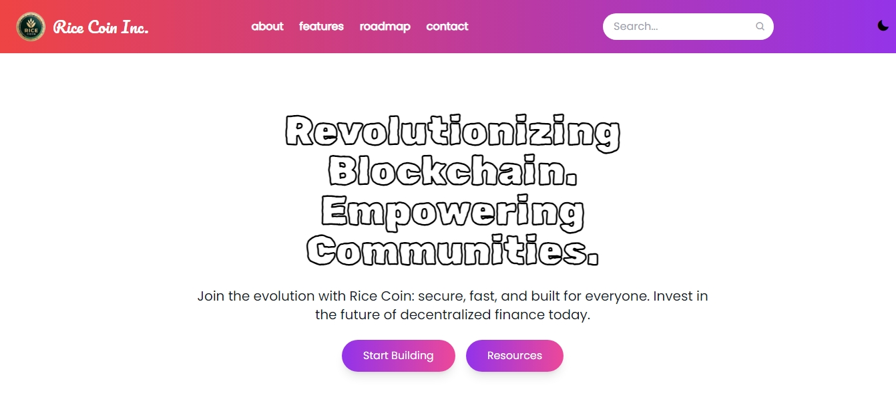

# 🚀 **Rice Coin Website**

Rice Coin adalah situs resmi yang dirancang untuk mempromosikan mata uang digital inovatif **Rice Coin**. Proyek ini berfokus pada antarmuka yang responsif, pengalaman pengguna yang optimal, dan fitur modern seperti **mode gelap** dan **navigasi hamburger**.

## Tautan Website
Kunjungi website yang sudah di-deploy melalui tautan berikut:
[Website Rice Coin ](https://adoyzola.site/)
---

## 📝 **Fitur Utama**
1. **Navigasi Responsif**
   - Sidebar yang dapat diakses melalui tombol hamburger.
   - Navigasi utama tetap terlihat di perangkat desktop.
2. **Mode Gelap**
   - Pengguna dapat dengan mudah beralih antara mode terang dan gelap.
   - Menggunakan utilitas bawaan Tailwind CSS.
3. **Pencarian Cepat**
   - Input pencarian dengan desain elegan dan responsif.
4. **Animasi Modern**
   - Efek hover pada kartu untuk meningkatkan pengalaman visual.

---

## 🛠 **Teknologi yang Digunakan**
- **HTML5**: Untuk struktur semantik halaman.
- **CSS3 + Tailwind CSS**: Untuk desain responsif dan efek visual.
- **JavaScript**: Untuk fitur interaktif seperti mode gelap dan hamburger menu.
- **Boxicons**: Untuk ikon yang ringan dan modern.

---

## 📂 **Struktur Proyek**
Rice-Coin-Website/ ├── assets/ Folder untuk gambar dan aset │ └── coin-logo/  Folder untuk logo proyek ├── Folder font untuk configurasi local ├── styles/ Folder untuk file CSS │ └── tailwind.css File konfigurasi CSS Tailwind  └── main.js  Script utama untuk fitur interaktif ├── index.html  Halaman utama website ├── tailwind.config.js  Konfigurasi Tailwind └── README.md  Dokumentasi proyek

---

## ⚙️ **Instalasi**
Ikuti langkah-langkah berikut untuk menjalankan proyek ini di mesin lokal Anda.

### 1. **Clone Repository**
```bash
git clone https://github.com/username/rice-coin-website.git
cd rice-coin-website

```
### 2. **Install Dependencies**
Proyek ini menggunakan Tailwind CSS. Pastikan Anda memiliki Node.js dan npm terinstal. Jalankan perintah berikut untuk menginstal Tailwind CSS:

```bash
npm install -D tailwindcss postcss autoprefixer
npx tailwindcss init
```

### 3. **Run Tailwind CLI**
Untuk memproses file Tailwind dan menghasilkan file CSS akhir, gunakan perintah berikut:

```bash
npx tailwindcss -i ./styles/tailwind.css -o ./dist/output.css --watch
```

### 4. **Buka di Browser**
Buka file `index.html` di browser favorit Anda untuk melihat hasilnya.

---

## 🔧 **Konfigurasi**
### **Mode Gelap**
Untuk mengaktifkan mode gelap berbasis class:
1. Pastikan `darkMode` diatur pada `class` di file `tailwind.config.js`:
   ```javascript
   module.exports = {
       darkMode: 'class',
       theme: { extend: {} },
       plugins: [],
   };
   ```
2. Tambahkan class `dark` pada elemen `html` untuk mengaktifkan mode gelap.

### **Hamburger Menu**
Fungsi JavaScript untuk navigasi hamburger terdapat di file `scripts/main.js`. Script ini mengelola toggle sidebar pada tampilan mobile.

---

## 📸 **Screenshot**
| **Desktop View**               | **Mobile View**               |
|---------------------------------|-------------------------------|
|  |  |

---

## 🏗 **Fitur yang Akan Datang**
- **Fitur Staking**: Halaman khusus untuk memudahkan pengguna dalam staking Rice Coin.
- **Animasi Scroll**: Transisi halus saat menggulir halaman.
- **Notifikasi Interaktif**: Untuk pemberitahuan langsung pada pengguna.

---

## 🤝 **Kontribusi**
Kontribusi selalu diterima! Ikuti langkah-langkah berikut untuk berkontribusi:
1. **Fork repository ini.**
2. **Buat branch fitur baru.**
   ```bash
   git checkout -b fitur-baru
   ```
3. **Commit perubahan Anda.**
   ```bash
   git commit -m "Tambah fitur baru"
   ```
4. **Push ke repository Anda.**
   ```bash
   git push origin fitur-baru
   ```
5. **Ajukan Pull Request.**

---

## 📞 **Kontak**
- **Email**: [support@ricecoin.site](mailto:support@ricecoin.site)
- **Website**: [Rice Coin](https://ricecoin.site)
- **Alamat**: Jl. Crypto Indonesia No. 88

---


# DEPLOYMENT ⚙️

Proyek ini telah berhasil dideploy menggunakan **Netlify** dan dapat diakses melalui tautan berikut:  
🌐 [https://ricecoin.site](https://ricecoin.site)

---

## Status Deployment
[](https://app.netlify.com/sites/ricecoin-site/deploys)

---

## 📖 Panduan Deployment

### 1. Hubungkan Akun Anda ke Netlify  
Langkah pertama untuk melakukan deploy di **Netlify** adalah membuat akun baru atau menggunakan akun yang sudah ada. Kami menyarankan menggunakan akun **GitHub** agar proses lebih cepat dan terintegrasi.

#### Langkah-Langkah:
- Masuk ke [Netlify](https://www.netlify.com) dan login.
- Klik **Add new site** → **Import existing project** → Hubungkan via **GitHub**.
- Pilih repositori proyek Anda, lalu klik **Deploy**. Proses build akan dimulai secara otomatis.

---


---

> **Tips:** Setelah deploy berhasil, setiap perubahan yang Anda push ke GitHub akan langsung memicu redeploy otomatis di Netlify! 🚀

---

### 2. Registrasi Domain dengan Hostinger & Cloudflare  
Untuk menggunakan domain kustom, ikuti langkah-langkah berikut:

#### Langkah 1: Beli Domain di Hostinger
- Kunjungi [Hostinger](https://www.hostinger.co.id) dan login.
- Cari domain yang Anda inginkan (contoh: `ricecoin.site`), lalu beli.


#### Langkah 2: Hubungkan ke Cloudflare
- Masuk ke [Cloudflare](https://dash.cloudflare.com), lalu login.
- Tambahkan domain yang Anda beli ke Cloudflare. Setelah domain berhasil ditambahkan, Anda akan menerima informasi **nameserver** dari Cloudflare seperti berikut:
   ```
   Tipe  Nilai
   NS    andronicus.ns.cloudflare.com
   NS    paislee.ns.cloudflare.com
   ```
- Masukkan nameserver ini ke pengaturan DNS di dashboard **Hostinger**.

---

### 3. Konfigurasi Domain di Netlify
Setelah domain terhubung dengan Cloudflare, lanjutkan konfigurasi domain di Netlify:

#### Langkah-Langkah:
1. Masuk ke dashboard Netlify.
2. Pilih proyek Anda → **Domain settings** → **Add custom domain**.
3. Masukkan domain Anda (contoh: `ricecoin.site`) dan ikuti instruksi untuk menyelesaikan pengaturan DNS.

#### Gunakan Subdomain (Opsional):
Jika Anda ingin menggunakan subdomain, tambahkan konfigurasi berikut di Cloudflare:  
   ```
   Tipe   Nilai            Konten
   CNAME  app              ricecoin-site.netlify.com
   ```

---

### 4. Konfigurasi DNS di Cloudflare
Masuk ke **Cloudflare dashboard** dan tambahkan DNS Records untuk domain Anda berdasarkan informasi dari Netlify.

#### Contoh Pengaturan:
   ```
   Tipe   Nama       Konten
   A      @          104.198.14.52
   CNAME  www        ricecoin-site.netlify.app
   ```

Setelah pengaturan selesai, simpan dan tunggu hingga propagasi DNS selesai (biasanya 1-24 jam).

---

## 🎉 Selamat, Deploy Berhasil!

Jika semua langkah sudah dilakukan, proyek Anda kini dapat diakses melalui domain kustom Anda.  
🔗 **Domain:** [https://ricecoin.site](https://ricecoin.site)

> **Catatan:** Tunggu hingga 24 jam untuk propagasi DNS jika domain belum aktif.

---

## ✨ Fitur Utama
- **Deploy Otomatis**: Semua perubahan di GitHub akan langsung terupdate di Netlify.
- **Domain Kustom**: Dukungan penuh untuk domain dari Hostinger.
- **Kecepatan Tinggi**: Website dideploy di Netlify dengan performa optimal.
- **Gratis SSL**: Sertifikat SSL disediakan secara otomatis melalui Netlify.

---

## 📬 Masukan & Saran
Kami sangat menghargai masukan dan saran untuk meningkatkan proyek ini. Jangan ragu untuk membuat issue atau pull request di repositori kami.

Selamat menjelajahi dan semoga sukses! 🚀


**© 2024 Rice Coin. Semua hak dilindungi.**